# Mémoire d'entreprise

> **Document de travail** — Rapport d'activités rédigé selon le plan type Cnam IDF.
> Le contenu est rédigé ; il reste à **personnaliser** les éléments propres à votre situation (noms, dates, unités d'enseignement, captures d'écran). Les indications en *italique* et les blocs `> Consigne` rappellent les attendus et la pagination cible : **supprimez-les avant le rendu final**.
>
> **Format visé :** une vingtaine de pages hors annexes. **Tonalité :** descriptive et informative. **À ne pas oublier :** page de garde, pagination, sommaire, introduction, conclusion.

---

## Page de garde

> Consigne : 1 page.

- **Titre :** Mémoire d'entreprise
- **Sous-titre proposé :** *Conception et déploiement d'un site web full-stack pour une chaîne de restauration : le cas Soup & Juice*
- **Intitulé de la formation :** _________________________
- **Année universitaire :** 20__ – 20__
- **Logos :** Cnam IDF · École · Soup & Juice
- **Rédacteur :** _________________________
- **Professeur référent :** _________________________
- **Maître d'apprentissage :** _________________________

---

## Remerciements

> Consigne : 1 page maximum. _Vérifiez / adaptez les noms ci-dessous à votre situation._

Je tiens tout d'abord à remercier sincèrement mon **maître d'apprentissage**, Directeur Général de l'entreprise, pour sa confiance, son accompagnement quotidien et le temps précieux qu'il m'a consacré tout au long de cette année. Sa disponibilité et la liberté qu'il m'a laissée dans mes choix techniques ont été déterminantes dans ma progression.

Mes remerciements s'adressent également à la **Présidence de l'entreprise**, pour m'avoir accueilli au sein de sa structure et m'avoir fait confiance sur un projet stratégique pour l'enseigne.

Je souhaite aussi exprimer ma gratitude envers la **Responsable des Ressources Humaines**, pour son aide précieuse et notre collaboration directe — notamment sur la conception de l'espace de formation interne — ainsi qu'à l'ensemble des **équipes de Soup & Juice** pour leur accueil chaleureux et leur disponibilité lors du recueil des besoins.

Enfin, je remercie mon **professeur référent**, ainsi que l'ensemble de l'**équipe pédagogique du Cnam**, pour la qualité de l'enseignement dispensé et le suivi rigoureux de mon apprentissage tout au long de l'année universitaire.

---

## Introduction

> Consigne : 1 page. Présenter le poste occupé et le cadre.

Dans le cadre de ma **Licence Générale Informatique en apprentissage** au Cnam, j'ai eu l'opportunité d'effectuer mon alternance en tant qu'**Apprenti Développeur Full Stack** au sein de l'entreprise **Soup & Juice**, une chaîne parisienne de restauration rapide « healthy ». Ce mémoire d'entreprise a pour objectif de retracer mon parcours, les compétences acquises et les missions qui m'ont été confiées au cours de cette année.

L'enjeu principal de mon poste a été de participer activement à la **restructuration numérique de l'enseigne**, en concevant, développant et maintenant des solutions techniques adaptées aux besoins de la restauration rapide moderne. Mon intervention s'est située à la **jonction entre les réalités du terrain** (les équipes en restaurant, le système de caisse) **et les outils numériques de gestion et de vente** (le site web, le back-office d'administration).

Au-delà de la simple production de code, ce poste m'a demandé de comprendre les **besoins métier** d'une enseigne, de les traduire en spécifications, puis de livrer des solutions fiables et exploitables par des utilisateurs non techniques.

Ce rapport s'articulera autour de **quatre axes** :

1. la **présentation de l'entreprise** et de mon environnement de travail ;
2. la description de mes **missions régulières** (développement, maintenance, conception UI/UX, recueil de besoins) ;
3. l'**analyse détaillée de ma mission principale** : la synchronisation automatisée des flux de données entre la caisse JDC et le site ;
4. une **réflexion analytique** sur l'articulation entre mes connaissances universitaires (architecture logicielle, bases de données, sécurité) et ma pratique professionnelle quotidienne.

---

## Table des matières

> Consigne : 1 page. Paginer l'ensemble du document, annexes comprises.

1. Introduction  
2. Partie 1 — Présentation de l'organisme d'accueil  
3. Partie 2 — Présentation du poste, des missions et des tâches  
4. Partie 3 — Synchronisation catalogue JDC ↔ site web  
5. Partie 4 — Bilan et articulation formation / pratique  
6. Conclusion  
7. **Annexes** (captures, schémas 1 à 7, extraits de code, configuration)  
8. Bibliographie  

_(Compléter les numéros de page avant rendu final.)_

---

## Partie 1 — Présentation de l'organisme d'accueil

> Consigne : 3 pages maximum. Décrire l'activité de l'entreprise (entreprise, services, équipe constituante, etc.).

### 1.1 L'entreprise Soup & Juice

L'entreprise d'accueil opère sous l'**enseigne Soup & Juice**. Il s'agit d'une **chaîne parisienne de restauration rapide** axée sur une offre « **healthy** », spécialisée dans la confection de **soupes maison** et de **jus frais pressés**. L'entreprise déploie son activité à travers **9 restaurants** implantés stratégiquement dans Paris.

Cette offre cœur est complétée par une gamme large, structurée en **10 catégories** pour un total d'environ **158 produits** :

| Catégorie | Exemples |
|-----------|----------|
| Jus | jus pressés à froid, jus du jour |
| Soupes | soupes maison, gaspachos, soupes du jour |
| Plats chauds | tikka massala, couscous, tortellini… |
| Salades | buddha bowl, salades composées |
| Sandwichs | wraps, bagels |
| Milkshakes | milkshakes fruités |
| Boosters | compléments énergétiques (collagène, graines de chia…) |
| Desserts | tiramisu, salades de fruits, cakes |
| Boissons | softs, boissons à emporter |
| Goodies | produits dérivés de la marque |

Soup & Juice attache par ailleurs une **grande importance à la transparence alimentaire**, notamment par la gestion rigoureuse des **14 allergènes réglementaires européens**, scrupuleusement intégrés et affichés dans les systèmes numériques de l'entreprise. La marque revendique une identité forte autour du **« bien manger »**, déclinée sur le site dans des pages dédiées (l'ADN de la marque, les piliers et engagements).

### 1.2 Les activités et canaux de distribution

Les canaux de distribution de l'enseigne sont **multiples** :

- la **vente en restaurant** (sur place ou à emporter), dans les 9 points de vente parisiens ;
- le **service traiteur (catering)** dédié aux événements d'entreprises ;
- une **forte présence digitale** via le site web officiel.

Ce dernier — objet central de ce mémoire — agit simultanément comme **vitrine commerciale**, **plateforme de présentation** des engagements de l'enseigne (l'ADN, les piliers), **outil d'information** (menu, allergènes, localisation des restaurants) et **portail de contact** (formulaire, inscription à la newsletter, chatbot d'assistance).

### 1.3 Structure de la direction et organisation de l'équipe

La direction de l'entreprise est assurée par un **binôme exécutif** : un **Président** et un **Directeur Général**. C'est ce dernier qui assure le rôle de **maître d'apprentissage** pour ma formation.

Au sein du **pôle technique et numérique**, j'occupe le poste d'**Apprenti Développeur Full Stack**. La structure de l'équipe se veut particulièrement **agile, horizontale et directe**. En tant que principal acteur technique interne, je ne suis pas isolé dans mes tâches de développement : je collabore en lien direct et constant avec mon maître d'apprentissage, qui valide les orientations techniques et stratégiques.

Je travaille également en étroite collaboration avec la **Responsable des Ressources Humaines**. Cette synergie est essentielle pour ancrer les développements numériques — tels que la création d'un **espace de formation interne** dédié au personnel de restauration — dans les réalités et les contraintes opérationnelles du quotidien.

### 1.4 Le système d'information et le cadre de l'apprentissage

Sur le plan technique, l'entreprise s'appuie sur deux référentiels distincts qui constituent le contexte de mes missions :

- un **système de caisse interne, JDC**, utilisé en restaurant, qui constitue la **source de vérité** des produits réellement vendus (prix, disponibilité) ;
- une **dimension digitale** (site web, base de données, back-office, chatbot) que j'ai eu la charge de développer et de maintenir.

L'apprentissage s'est ainsi déroulé à l'**interface entre les besoins métier** (direction, marketing, équipes en restaurant) **et la technique**, ce qui m'a permis de travailler aussi bien sur la partie visible (le site public) que sur les outils internes (le back-office et la synchronisation avec la caisse).

---

## Partie 2 — Présentation du poste, des missions et des tâches

> Consigne : 5 pages maximum. Rendre compte des activités réalisées.

En tant qu'Apprenti Développeur Full Stack, mon rôle s'étend sur l'**intégralité du cycle de vie des produits numériques** de l'enseigne. Bien qu'une grande partie de mon temps ait été consacrée à un projet majeur d'intégration de données (la synchronisation JDC, détaillée en Partie 3), mon quotidien s'articule autour de plusieurs **missions régulières et transversales** indispensables à la pérennité de l'infrastructure technologique.

### 2.1 Maintenance et déploiement de l'écosystème web

Ma responsabilité première est d'assurer la **maintenance continue** du site vitrine et de son API backend. Le projet repose sur une **architecture full-stack moderne** : un backend **Node.js / Express** (port 4000) couplé à une interface frontend développée en **React 19 et Vite 7**.

Les mises en production sur le domaine officiel s'effectuent via des **scripts automatisés** que j'ai mis en place :

- compilation du frontend (`vite build`) et génération des pages statiques (SSG) ;
- démarrage et supervision du serveur via **PM2** ;
- gestion du **reverse proxy Nginx**.

Cette mission exige une **réactivité de tous les instants** pour assurer la haute disponibilité du service, appliquer des correctifs de bugs et veiller au maintien des **standards de sécurité** : redirections automatiques vers HTTPS, utilisation de **Helmet** pour définir la politique de sécurité des contenus (CSP), contrôle du CORS et gestion des sessions d'administration.

### 2.2 Conception UI/UX et expérience client

L'optimisation de l'**expérience utilisateur (UX)** et de l'**interface utilisateur (UI)** est un volet critique de mon apprentissage. Le site devant refléter l'image qualitative et moderne de la marque, j'ai conçu et amélioré de nombreuses interfaces :

- **un menu interactif** avec un filtrage fluide par catégories et la gestion d'une arborescence **multilingue (français / anglais)** ;
- **des fiches produits enrichies** mettant en avant les atouts nutritionnels (pictogrammes végétarien / végan) et signalant clairement la présence d'**allergènes** ;
- **une cartographie interactive** des 9 restaurants parisiens, utilisant la technologie **MapLibre** (avec stations de métro et points d'intérêt).

Un effort spécifique a été porté sur l'**accessibilité numérique** (ajout rigoureux d'attributs **ARIA**, gestion du *focus trap* pour les modales) ainsi que sur les **performances web** (mise en place du chargement différé, ou *lazy loading*, des composants lourds). L'intégration d'un **chatbot hybride IA**, propulsé par **Google Gemini** (modèle `gemini-2.5-flash`), a également constitué un accomplissement majeur pour dynamiser le parcours utilisateur tout en fournissant une assistance fiable (menu, allergènes, localisation).

### 2.3 Recueil de besoins et réunions d'équipe

Le développement logiciel au sein de Soup & Juice s'inscrit dans une démarche très **pragmatique**. Je participe régulièrement à des **réunions de suivi** et des séances de travail avec la direction et le service RH. Mon objectif y est de **traduire des expressions de besoin brutes** (par exemple : « Comment faciliter l'intégration d'un nouvel employé en magasin ? ») en **spécifications fonctionnelles et techniques**.

C'est au travers de ce recueil d'informations continu que j'ai pu concevoir l'**espace de formation interne sécurisé** destiné au personnel de restauration, ou encore modeler le **back-office d'administration** pour qu'il soit parfaitement adapté au niveau de maîtrise technique de ses utilisateurs finaux (non développeurs).

### 2.4 Synthèse des missions et environnement technique

L'ensemble de ces missions peut être résumé comme suit :

| Domaine | Réalisations |
|---------|--------------|
| Site vitrine | Pages multilingues (Accueil, Menu, Restaurants, ADN, Catering, Contact, FAQ, pages légales) |
| Cartographie | Carte interactive des 9 restaurants (MapLibre) |
| API backend | Endpoints catalogue, restaurants, contact, newsletter, chatbot |
| Base de données | Modèle produits, catégories, allergènes, traductions, fiches enrichies (SQLite) |
| Back-office | Gestion CRUD du catalogue, allergènes, traductions, mapping caisse |
| Intégration | Synchronisation automatique avec la caisse JDC |
| IA | Chatbot d'assistance (Google Gemini) |
| SEO & conformité | Génération statique (SSG), JSON-LD, sitemap, consentement RGPD |
| Exploitation | Déploiement PM2, reverse proxy Nginx, HTTPS |

Sur le plan des technologies mobilisées :

| Couche | Technologies |
|--------|-------------|
| Frontend | React 19, Vite 7, React Router 7, i18next, MapLibre GL |
| Backend | Node.js (modules ES), Express 5, Helmet, CORS, express-session |
| Base de données | SQLite (`better-sqlite3`) |
| IA | Google Gemini (`gemini-2.5-flash`) |
| Emails | Nodemailer (SMTP) |
| Déploiement | PM2, Nginx (reverse proxy), HTTPS |

---

## Partie 3 — Une grande mission valorisée autour d'une problématique

> Consigne : 8 pages (± 1 page). Le processus doit être décrit en entier. Prendre du recul : aspects d'un problème, méthode, situation professionnelle, changement intervenu.

### Titre de la mission

**La synchronisation automatique du catalogue produits entre le système de caisse interne (JDC) et le site web.**

### 3.1 Contexte et problématique

Soup & Juice gère son catalogue produits à deux endroits distincts :

- d'une part dans **JDC**, le système de caisse interne utilisé en restaurant, qui fait foi pour les **prix** et la **disponibilité réelle** des produits vendus ;
- d'autre part sur le **site web**, où le menu doit être présenté au public avec des informations enrichies (photos, descriptions, allergènes, traductions FR/EN, bienfaits, formules).

Avant la mission, ces deux mondes étaient **désynchronisés** : toute création, suppression ou retrait d'un produit en caisse devait être **reportée manuellement** sur le site. Cette opération était chronophage et source d'erreurs : un produit retiré de la vente pouvait rester affiché en ligne, et inversement un nouveau produit n'apparaissait pas sur le site.

> **Problématique retenue :** *comment garantir que le menu publié en ligne reste cohérent avec le catalogue réel de la caisse, sans pour autant figer les produits dont la présentation relève d'un travail éditorial et marketing propre au site ?*

L'enjeu est double et porte une **tension** à résoudre : il faut **automatiser** la cohérence (pour fiabiliser et soulager les équipes) tout en **préservant la maîtrise éditoriale** sur certaines familles de produits (jus, milkshakes, desserts…) qui changent souvent et dont les fiches sont travaillées à la main.

### 3.2 Analyse du besoin et contraintes

L'analyse a fait émerger plusieurs exigences :

1. **JDC doit être la source de vérité** pour l'existence et la visibilité des produits standards (soupes, plats chauds, salades, sandwichs).
2. **Certaines catégories doivent rester 100 % manuelles** : jus, milkshakes, boosters, goodies, boissons et desserts. Elles ne doivent jamais être touchées par la synchronisation.
3. **Les matières premières et produits d'entretien** présents dans JDC (antipasti, sauces, pains, produits d'entretien…) ne doivent **jamais** remonter sur le site.
4. **Les métadonnées enrichies du site** (description, photo, allergènes, traductions, fiches) doivent être **conservées** même quand un produit est synchronisé depuis JDC.
5. La synchronisation doit pouvoir s'exécuter **automatiquement** (au démarrage et périodiquement) **et** **à la demande** depuis le back-office.
6. Un **garde-fou** est indispensable : une mauvaise configuration ne doit jamais aboutir à vider le catalogue en ligne.

### 3.3 Conception de la solution

#### a. Architecture à double source de vérité

La solution repose sur une **base de données locale (SQLite)** qui agit comme **catalogue maître du site**, alimentée par une **synchronisation entrante** depuis le catalogue JDC. Le flux technique traverse trois maillons : le **serveur Node.js** du site, une **fonction Edge Supabase** (`public-products`) et le **serveur API JDC** (source de vérité caisse). Voir **schéma 1** (annexe 3).

**Schéma 1 — Architecture réseau de la chaîne de synchronisation**

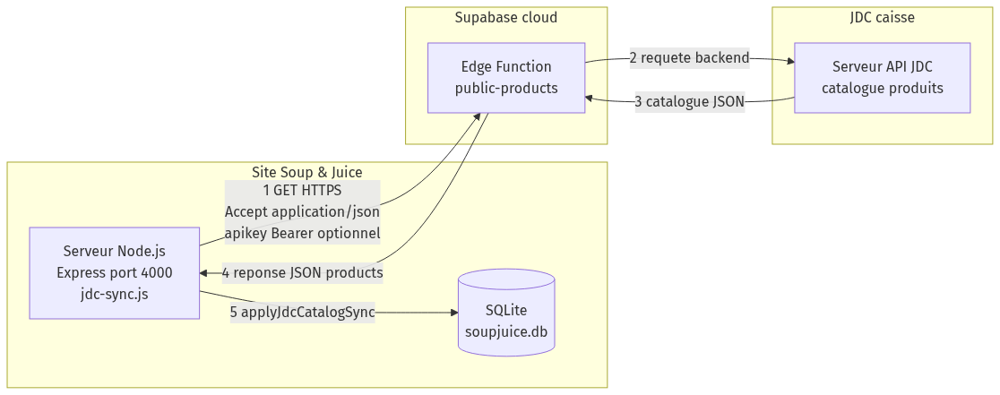

Chaque produit du site possède un champ `jdc_id` qui fait le **lien** avec son équivalent en caisse. C'est la clé de rapprochement entre les deux systèmes.

#### b. Le concept clé : le mode de gestion par catégorie (`managed_by`)

L'élément central de la conception est l'attribut **`managed_by`** ajouté à chaque catégorie du site, qui peut valoir :

- **`'jdc'`** : la catégorie est **pilotée par la caisse** (les produits y sont créés, réactivés ou masqués automatiquement) ;
- **`'site'`** : la catégorie est **100 % manuelle** et **jamais touchée** par la synchronisation (jus, milkshakes, boosters, goodies, boissons, desserts).

Ce simple attribut permet de résoudre la tension identifiée dans la problématique : automatiser là où c'est pertinent, protéger l'éditorial ailleurs.

#### c. Le filtrage des catégories JDC

Côté JDC, toutes les catégories ne sont pas synchronisables. La logique est **codifiée explicitement** dans le module `jdc-categories.js`, sous forme de listes et d'ensembles (`Set`) maintenables sans toucher au cœur de l'algorithme.

**Catégories « matières premières / entretien »** — jamais synchronisées (`JDC_SUPPLY_CATEGORIES`) :

| Catégorie JDC |
|---------------|
| Antipasti |
| Produit d'entretien |
| Fruits et pulpe |
| Sauces |
| Produits de la mer |
| Pains sandwiches |

**Catégories produit fini gérées manuellement côté site** — exclues de la sync (`JDC_MANUAL_SITE_CATEGORIES`) :

| Catégorie JDC |
|---------------|
| Boissons |
| Goodies |
| Desserts |
| Desserts individuels |
| Cakes sucrés |

**Catégories site toujours hors sync JDC** — forcées en mode `'site'` au démarrage (`SITE_MANAGED_CATEGORY_CODES`) :

| Code catégorie site |
|---------------------|
| JUS |
| MILKSHAKES |
| BOOSTERS |
| GOODIES |
| BOISSONS |
| DESSERTS |

Au **démarrage du serveur**, une requête idempotente réapplique cette règle :

```sql
UPDATE category SET managed_by = 'site'
WHERE code IN ('JUS', 'MILKSHAKES', 'BOOSTERS', 'GOODIES', 'BOISSONS');
```

Ainsi, même après une migration ou une erreur de configuration, les catégories éditoriales restent **sanctuarisées**.

**Catégories éligibles à la synchronisation** (exemples) : Soupes, Plats chauds, Salades, Sandwichs.

#### d. Le mapping de catégories

Comme les noms de catégories diffèrent entre JDC et le site, une **table de correspondance** (`jdc_category_mapping`) relie chaque catégorie JDC (identifiée par un **UUID**) à une catégorie du site (clé entière `category.id`).

Deux mécanismes coexistent :

1. **Découverte automatique** (pendant la sync) : insertion avec `site_category_id = NULL` si la catégorie est inconnue — **sans écraser** un mapping déjà configuré.
2. **Configuration manuelle** (via l'admin) : la fonction `upsertJdcCategoryMapping` peut **assigner ou modifier** `site_category_id`, avec validation que la catégorie site existe bien en base.

Une catégorie JDC mappée à `NULL` est traitée comme **« vue mais ignorée »** : ses produits sont comptabilisés dans `ignored_categories` et remontent à l'administrateur pour décision.

#### e. Le garde-fou anti-vidage

Tant qu'**aucune** catégorie JDC n'est mappée vers une catégorie du site en mode `'jdc'`, la synchronisation est **entièrement sautée** (statut `no_category_mappings`). Sans cette précaution, un premier lancement mal configuré aurait masqué tous les produits sans rien créer en face. Ce choix illustre une démarche de conception **défensive**.

#### f. Le modèle de données

La synchronisation repose sur trois éléments structurels ajoutés au schéma de la base SQLite :

1. **Une colonne `jdc_id` sur la table `produit`**, indexée, qui établit le lien avec l'identifiant du produit en caisse :

```sql
ALTER TABLE produit ADD COLUMN jdc_id TEXT;
CREATE INDEX IF NOT EXISTS idx_produit_jdc_id ON produit(jdc_id);
```

2. **Une colonne `managed_by` sur la table `category`** (valeur par défaut `'jdc'`), qui détermine le mode de gestion de la catégorie :

```sql
ALTER TABLE category ADD COLUMN managed_by TEXT NOT NULL DEFAULT 'jdc';
```

3. **Une table de correspondance `jdc_category_mapping`**, qui relie une catégorie JDC (identifiée par un UUID) à une catégorie du site. Le champ `site_category_id` peut être `NULL` : la catégorie JDC est alors « vue mais pas encore mappée ».

```sql
CREATE TABLE IF NOT EXISTS jdc_category_mapping (
  jdc_category_id   TEXT PRIMARY KEY,
  jdc_category_name TEXT NOT NULL,
  site_category_id  INTEGER,
  updated_at        TEXT DEFAULT (datetime('now')),
  FOREIGN KEY (site_category_id) REFERENCES category(id) ON DELETE SET NULL
);
```

Ce modèle découple volontairement **trois informations** : l'identité d'un produit (`jdc_id`), le mode de gestion de sa catégorie (`managed_by`) et la correspondance des catégories (`jdc_category_mapping`). C'est cette séparation qui rend les règles métier configurables sans toucher au code. Voir **schéma 2** (annexe 4).

#### g. La règle d'éligibilité d'un produit JDC

Le filtrage des catégories est centralisé dans une fonction unique, garante de cohérence sur l'ensemble du système :

```javascript
export function isJdcSyncProduct(product) {
  const name = String(product?.category_name || "").trim();
  if (!name) return false;
  if (JDC_SUPPLY_CATEGORIES.has(name)) return false;       // matières premières / entretien
  if (JDC_MANUAL_SITE_CATEGORIES.has(name)) return false;  // gérées manuellement côté site
  return true;
}
```

Les ensembles `JDC_SUPPLY_CATEGORIES` et `JDC_MANUAL_SITE_CATEGORIES` matérialisent les règles métier sous forme de simples listes, faciles à faire évoluer.

#### h. Répartition des modules et responsabilités

La fonctionnalité est découpée en **trois fichiers** aux rôles bien séparés :

| Fichier | Rôle |
|---------|------|
| `server/jdc-categories.js` | Règles métier : listes de catégories exclues, éligibilité (`isJdcSyncProduct`), correspondance départements caisse ↔ catégories |
| `server/jdc-sync.js` | Orchestration : appel HTTP JDC, planification (`startJdcSyncScheduler`), verrou, état `lastSync`, endpoints consommés par l'admin |
| `server/db.js` | Persistance : fonction `applyJdcCatalogSync`, transactions SQL, mapping catégories, CRUD admin |

Ce découpage respecte une **séparation des préoccupations** : les règles métier (catégories) restent modifiables sans toucher à la logique réseau ni aux requêtes SQL.

#### i. Modèle de données JDC (format JSON)

Chaque produit renvoyé par l'API JDC est un objet JSON. Les champs **réellement exploités** par la synchronisation sont :

| Champ JDC | Type | Usage côté site |
|-----------|------|-----------------|
| `id` | UUID (string) | Stocké dans `produit.jdc_id` — clé de rapprochement |
| `name` | string | Nom du produit à la création |
| `category_id` | string | Identifiant de catégorie JDC (clé du mapping) |
| `category_name` | string | Filtrage via `isJdcSyncProduct` |
| `price_b2c` | number \| null | Prix public à l'insertion |
| `unit` | string \| null | Informatif (non écrasé après création) |

Les champs **non synchronisés** après création (volontairement) : `description`, `image_url`, `image_alt`, tables `produit_translation`, `produit_allergene`, `produit_sheet`. C'est ce choix qui **préserve le travail éditorial** du site.

Exemple simplifié de payload :

```json
{
  "products": [
    {
      "id": "a1b2c3d4-e5f6-7890-abcd-ef1234567890",
      "name": "Soupe carottes",
      "category_id": "cat-soupes-001",
      "category_name": "Soupes",
      "price_b2c": 6.50,
      "unit": "bol"
    }
  ]
}
```

#### j. Évolution du modèle : de la visibilité seule (v1) à la sync catalogue (v2)

Le projet a connu une **évolution architecturale** documentée dans le code :

- **Version 1 (legacy)** — fonction `applyJdcVisibility` : se contentait d'activer/désactiver des produits déjà présents en base selon une liste d'UUID JDC. Ne créait **aucun** produit nouveau.
- **Version 2 (actuelle)** — fonction `applyJdcCatalogSync` : en plus de la visibilité, **crée** les produits absents, **enregistre** les catégories JDC découvertes, et respecte le mode `managed_by` par catégorie.

Cette montée en version répondait au besoin métier : la caisse devient **source du catalogue**, pas seulement un interrupteur on/off sur des produits préexistants.

### 3.4 Réalisation — le processus de synchronisation en entier

Un cycle de synchronisation se déroule en plusieurs étapes, exécutées pour l'essentiel dans une **transaction** unique de la base (garantissant l'atomicité : tout réussit, ou rien n'est modifié).

**Étape 0 — Récupération des données JDC.**
Le module interroge en HTTP l'API publique du catalogue de caisse — une **fonction *Edge* Supabase** (`/functions/v1/public-products`) qui expose le flux JSON des produits. Une **clé d'authentification** optionnelle (`apikey` + en-tête `Authorization: Bearer`) est transmise si elle est configurée, ce qui permet de sécuriser l'accès le jour où la fonction l'exige. La réponse est ensuite **validée défensivement** à trois niveaux :

```javascript
const res = await fetch(url, { headers });
if (!res.ok) {                                   // 1. code HTTP d'erreur
  const text = await res.text().catch(() => "");
  throw new Error(`HTTP ${res.status} ${res.statusText} — ${text.slice(0, 200)}`);
}
let payload;
try { payload = await res.json(); }              // 2. réponse non-JSON
catch (err) { throw new Error(`Réponse non-JSON : ${err.message}`); }

const products = Array.isArray(payload?.products) ? payload.products
  : Array.isArray(payload) ? payload : null;     // 3. structure inattendue
if (!products) throw new Error("Réponse JDC inattendue : champ `products` absent.");
```

Cette triple vérification garantit qu'une panne ou un changement de format côté caisse est **détecté et tracé** plutôt que de corrompre silencieusement le catalogue du site.

**Étape 1 — Filtrage.**
Seuls les produits appartenant à une catégorie **synchronisable** sont retenus ; les matières premières et catégories manuelles sont écartées dès l'entrée.

**Étape 2 — Vérification du garde-fou.**
On vérifie qu'au moins une catégorie est mappée vers une catégorie site `'jdc'`. Sinon, on s'arrête proprement avec un compte rendu explicatif.

**Étape 3 — Enregistrement des catégories vues.**
Chaque catégorie JDC rencontrée est insérée dans la table de mapping via un **`UPSERT` SQLite** (`INSERT … ON CONFLICT DO UPDATE`). Point crucial : le conflit **ne met à jour que** `jdc_category_name` et `updated_at` — le champ `site_category_id` **n'est jamais écrasé** si un administrateur l'a déjà renseigné :

```sql
INSERT INTO jdc_category_mapping (jdc_category_id, jdc_category_name, site_category_id, updated_at)
VALUES (?, ?, NULL, datetime('now'))
ON CONFLICT(jdc_category_id) DO UPDATE SET
  jdc_category_name = excluded.jdc_category_name,
  updated_at = excluded.updated_at;
```

Après cette insertion, les mappings sont **rechargés en mémoire** (`catMapByJdc`) avant le traitement produit par produit, afin d'intégrer les catégories fraîchement découvertes.

**Étape 4 — Traitement produit par produit.** Pour chaque produit JDC éligible, l'algorithme applique l'un de quatre traitements selon l'état du produit côté site. On peut le résumer par la **table de décision** suivante :

| Catégorie JDC mappée vers une cat. `'jdc'` ? | Produit existe côté site (`jdc_id`) ? | État actuel | Action |
|:---:|:---:|:---:|:---|
| Non | — | — | **Ignoré** (la catégorie remonte à l'admin) |
| Oui | Non | — | **Création** (nom, prix, catégorie cible, `visible = 1`) |
| Oui | Oui | masqué | **Réactivation** (`visible = 1`) |
| Oui | Oui | visible | **Inchangé** (métadonnées enrichies préservées) |

Concrètement, le cœur de la boucle ressemble à ceci :

```javascript
const catInfo = catMapByJdc.get(p?.category_id || "");
const isMapped =
  catInfo && catInfo.siteCatId != null && catInfo.managedBy === "jdc";
if (!isMapped) {
  ignored_categories[p.category_name] = (ignored_categories[p.category_name] || 0) + 1;
  continue;
}

const existing = findByJdcId.get(jdcId);
if (!existing) {
  insertProd.run(name, catInfo.siteCatId, price, jdcId); // création, visible = 1
} else if (!existing.visible && existing.managed_by === "jdc") {
  reactivate.run(existing.id);                            // réactivation
}
```

**Étape 5 — Masquage des produits disparus.**
Les produits du site situés dans une catégorie `'jdc'` **mais absents** de la liste JDC reçue (ou sans `jdc_id`) sont passés à `visible = 0`. Ils ne sont **pas supprimés** : leurs fiches enrichies sont conservées en cas de retour du produit. Une table temporaire contenant les UUID reçus permet d'exprimer cette règle en une seule requête ensembliste :

```sql
UPDATE produit
SET visible = 0, updated_at = datetime('now')
WHERE visible = 1
  AND category_id IN (SELECT id FROM category WHERE managed_by = 'jdc')
  AND (
    jdc_id IS NULL
    OR TRIM(jdc_id) = ''
    OR jdc_id NOT IN (SELECT uuid FROM _jdc_uuid_tmp)
  );
```

Le choix de **masquer** (`visible = 0`) plutôt que de **supprimer** est délibéré : il garantit la **réversibilité** et préserve tout le travail éditorial associé au produit.

**Étape 6 — Compte rendu.**
La fonction `applyJdcCatalogSync` renvoie un **objet statistique** structuré, repris ensuite par `runJdcSync` dans l'état global `lastSync` :

| Champ retourné | Signification |
|----------------|---------------|
| `jdc_received` | Nombre total de produits dans la réponse JDC (avant filtrage) |
| `matched_in_jdc` | Produits locaux possédant un `jdc_id` connu |
| `visible_before` / `visible_after` | Compteur de produits visibles avant / après le cycle |
| `activated` | Produits réactivés (`visible` passé de 0 à 1) |
| `deactivated` | Produits masqués (absents du flux JDC) |
| `created` | Tableau `[{ id, jdc_id, name }]` des créations |
| `ignored_categories` | Objet `{ "NomCatJDC": count }` des produits ignorés faute de mapping |
| `skipped` | `"no_category_mappings"` si le garde-fou a bloqué le cycle |

L'état **`lastSync`** conservé en mémoire par le module expose en outre :

- `status` : `'idle'` \| `'running'` \| `'ok'` \| `'error'`
- `ran_at` : horodatage ISO 8601 du dernier cycle
- `duration_ms` : durée d'exécution en millisecondes
- `source_url` : URL de l'API interrogée
- `error` : message d'erreur le cas échéant

L'endpoint `GET /api/admin/jdc-sync/status` agrège ces informations avec un **résumé catalogue** (`total_products`, `mapped_products`, `visible_products`) et la **configuration active** (`enabled`, `interval_min`, `has_anon_key`).

#### Paramètres SQLite et intégrité

La base `soupjuice.db` est configurée au démarrage avec deux pragmas importants pour la synchronisation :

```javascript
db.pragma("journal_mode = WAL");   // Write-Ahead Logging : lectures concurrentes pendant les écritures
db.pragma("foreign_keys = ON");    // intégrité référentielle (mapping → category)
```

Le mode **WAL** (*Write-Ahead Logging*) permet au site de continuer à **servir des lectures** pendant qu'une transaction de synchronisation écrit en base — un point important pour la disponibilité en production.

#### Déclenchement de la synchronisation

Le cycle a été conçu pour être **totalement asynchrone** (sans bloquer le serveur web) et s'exécute selon trois déclencheurs :

- **au démarrage** du serveur (`boot`), en mode « best-effort » ;
- **périodiquement** via une tâche planifiée (`setInterval`), à intervalle configurable (30 min par défaut) ;
- **à la demande** depuis le back-office (bouton dédié, source `admin`).

Toute la configuration est externalisée dans des **variables d'environnement**, ce qui permet d'adapter le comportement sans modifier le code :

| Variable | Rôle | Défaut |
|----------|------|--------|
| `JDC_SYNC_ENABLED` | Active / désactive la synchronisation | `1` (activée) |
| `JDC_PUBLIC_PRODUCTS_URL` | URL de la fonction Edge Supabase | URL par défaut |
| `JDC_ANON_KEY` | Clé d'authentification optionnelle | vide |
| `JDC_SYNC_INTERVAL_MIN` | Intervalle de re-synchronisation (minutes) ; `0` = boot uniquement | `30` |

Le planificateur est initialisé au démarrage du serveur via `startJdcSyncScheduler()` :

```javascript
export function startJdcSyncScheduler() {
  if (!cfg.enabled) return;

  runJdcSync({ source: "boot" }).catch(/* log */);

  if (cfg.intervalMin > 0) {
    interval = setInterval(() => {
      runJdcSync({ source: "cron" }).catch(/* log */);
    }, cfg.intervalMin * 60_000);
  }
}
```

Chaque cycle est **traçable par sa source** : `"boot"`, `"cron"` ou `"admin"`, ce qui facilite le diagnostic en cas d'anomalie.

#### Robustesse

Trois mécanismes garantissent l'intégrité des données et la continuité de service :

1. **Verrou applicatif (mutex logiciel).** Un drapeau `running` empêche deux cycles de synchronisation de s'exécuter simultanément. Sans lui, deux requêtes concurrentes (par exemple le cron et un déclenchement manuel) pourraient entrer en collision sur la base.
2. **Atomicité transactionnelle.** L'ensemble des écritures (création, réactivation, masquage) est encapsulé dans une **transaction SQLite unique** (`BEGIN TRANSACTION` / `COMMIT`). Si une erreur survient en cours de route, un **`ROLLBACK`** implicite annule toutes les modifications : la base ne reste jamais dans un état intermédiaire incohérent.
3. **Tolérance aux pannes.** Toute exception est **capturée et tracée** (statut `error`, message horodaté) sans interrompre le serveur : le site continue de servir les dernières données valides présentes en base.

À ces protections s'ajoute le choix du **« soft delete »** (masquage logique plutôt que suppression physique) déjà évoqué, qui rend chaque cycle **entièrement réversible**.

```javascript
export async function runJdcSync({ source = "manual" } = {}) {
  if (running) {
    return { ok: false, error: "Sync déjà en cours.", lastSync };
  }
  running = true;
  try {
    const products = await fetchJdcProducts();
    const stats = applyJdcCatalogSync(products);   // tout le travail dans une transaction
    // ... mise à jour de l'état lastSync (statistiques) ...
    return { ok: true, lastSync, skipped: stats.skipped || null };
  } catch (err) {
    // ... statut 'error', message tracé, service non interrompu ...
  } finally {
    running = false;                                // libération du verrou
  }
}
```

#### Le pilotage depuis le back-office

Pour rendre la fonctionnalité utilisable par une personne non technique, une série d'**endpoints d'administration** (protégés par session) ont été exposés et reliés à l'interface du back-office :

| Endpoint | Rôle |
|----------|------|
| `GET /api/admin/jdc-sync/status` | État de la dernière synchronisation + configuration |
| `POST /api/admin/jdc-sync/run` | Déclenchement manuel d'un cycle |
| `GET /api/admin/jdc-sync/catalog` | Liste des produits JDC actuels (aide au mapping) |
| `GET /api/admin/jdc-sync/category-mappings` | Liste des correspondances de catégories |
| `PUT /api/admin/jdc-sync/category-mappings/:jdcCategoryId` | Création / modification d'une correspondance |

Grâce à ces routes, l'administrateur peut **mapper une nouvelle catégorie JDC** vers une catégorie du site, **basculer** une catégorie entre les modes `'jdc'` et `'site'`, **lancer** une synchronisation à la demande et **consulter** le compte rendu (produits créés, réactivés, désactivés, catégories ignorées).

**Endpoint complémentaire — bascule du mode de gestion :**

| Endpoint | Corps JSON | Rôle |
|----------|------------|------|
| `PUT /api/admin/categories/:id/managed-by` | `{ "managed_by": "jdc" \| "site" }` | Change le mode d'une catégorie site sans modifier le code |

**Corps de requête pour le mapping d'une catégorie JDC :**

```json
PUT /api/admin/jdc-sync/category-mappings/:jdcCategoryId
{
  "jdc_category_name": "Soupes",
  "site_category_id": 2
}
```

Si `site_category_id` est omis ou `null`, la catégorie JDC est **mémorisée comme connue mais ignorée** — utile pour documenter explicitement qu'une catégorie ne doit pas remonter sur le site.

**Endpoint d'aide au mapping** — `GET /api/admin/jdc-sync/catalog` appelle JDC en direct (sans cache) et renvoie pour chaque produit éligible : `{ id, name, category_id, category_name, unit, price_b2c }`. L'administrateur peut ainsi **visualiser le catalogue caisse actuel** avant de configurer les correspondances.

#### Règles de non-écrasement (produits existants)

Lorsqu'un produit possède déjà un `jdc_id` en base, la synchronisation **ne modifie ni le nom, ni le prix, ni la catégorie, ni les métadonnées enrichies**. Seul le champ **`visible`** peut changer (réactivation ou masquage). Ce comportement est codé explicitement dans les commentaires de `applyJdcCatalogSync` :

- produit existant + présent dans JDC → **laissé tel quel**, éventuellement réactivé ;
- produit existant + absent de JDC → **masqué** si catégorie `'jdc'`.

À la **création** uniquement, les champs suivants sont initialisés depuis JDC :

```sql
INSERT INTO produit (name, category_id, price, jdc_id, visible, sort_order, created_at, updated_at)
VALUES (?, ?, ?, ?, 1, 0, datetime('now'), datetime('now'));
```

Le nom de repli si JDC envoie un libellé vide : `Produit JDC {8 premiers caractères de l'UUID}`.

#### Articulation avec le mapping de caisse (POS)

La synchronisation s'inscrit dans un dispositif plus large de **mise en correspondance avec la caisse**. Outre le mapping JDC ↔ site, le fichier `jdc-categories.js` définit deux tables de routage entre **départements de caisse** (écrans POS) et catégories :

**Départements synchronisés via JDC** (`POS_DEPT_TO_JDC_SYNC`) :

| Département caisse | Catégorie(s) JDC |
|--------------------|------------------|
| soupes | Soupes |
| formules soupe | Soupes |
| plats | Plats chauds |
| salade | Salades |
| sandwich | Sandwichs |

**Départements gérés manuellement côté site** (`POS_DEPT_TO_SITE_MANUAL`) :

| Département caisse | Code catégorie site |
|--------------------|---------------------|
| jus de fruits / jus de fruit / formules jus | JUS |
| soft / boissons / boissons à emporter / biere / autres | BOISSONS |
| divers | GOODIES |
| desserts / dessert | DESSERTS |

En parallèle, la table **`pos_mapping`** (en base SQLite) lie les **SKU / boutons de caisse** aux produits du site. Un index d'unicité garantit qu'un produit site ne soit la cible que d'**un seul** mapping POS :

```sql
CREATE UNIQUE INDEX IF NOT EXISTS idx_pos_mapping_produit_unique
  ON pos_mapping(produit_id) WHERE produit_id IS NOT NULL;
```

Cette **triple cartographie** (catégories JDC → catégories site → départements POS → produits) assure la cohérence de bout en bout, du bouton de caisse jusqu'à la fiche produit en ligne.

#### Flux côté frontend après synchronisation

Une fois la base mise à jour, le site public consomme le catalogue via l'API **`GET /api/catalog`**, qui agrège en une seule réponse :

- les produits visibles (`visible = 1`) ;
- le référentiel des 14 allergènes ;
- les fiches enrichies (`produit_sheet`) ;
- les traductions FR/EN.

Le frontend React charge ce catalogue au montage de la page Menu ; un cycle JDC réussi se traduit donc **automatiquement** en menu à jour, sans redéploiement ni intervention manuelle sur les fichiers statiques.

### 3.5 Résultats obtenus et impact métier

Le déploiement de cette fonctionnalité a été un **succès opérationnel** dont les effets se mesurent à plusieurs niveaux.

**Impact métier.** L'automatisation a instantanément :
- **éradiqué les écarts tarifaires** et l'obsolescence du menu en ligne (un prix modifié en caisse se répercute en quelques minutes sur le site) ;
- **supprimé des heures de double saisie manuelle** pour les employés, qui n'ont plus à reporter les changements de carte ;
- **fiabilisé l'information client** (un produit en rupture disparaît automatiquement de la vitrine).

**Maîtrise éditoriale préservée.** Les catégories sanctuarisées (jus pressés, goodies, desserts…) restent **100 % sous contrôle** de l'équipe communication, conformément à l'exigence initiale.

**Observabilité.** Le système a été conçu pour être **hautement observable** : à l'issue de chaque cycle, un **rapport statistique** (produits créés, réactivés, désactivés, catégories ignorées, produits visibles avant/après, durée) est généré et **directement consultable par la direction** depuis le back-office. Les nouvelles catégories JDC y sont également signalées, rendant le dispositif **évolutif et découvrable**.

En définitive, l'entreprise **maîtrise désormais ses flux d'informations de bout en bout**, avec une hybridation réussie entre les impératifs du e-commerce et la réalité physique de ses points de vente.

### 3.6 Prise de recul

Cette mission m'a confronté à un **vrai problème d'architecture** : faire dialoguer deux systèmes aux responsabilités différentes sans qu'aucun n'écrase le travail de l'autre. Le concept de **mode de gestion par catégorie** (`managed_by`) a été la clé : il transforme une règle métier floue (« certaines choses sont automatiques, d'autres non ») en une **donnée explicite et configurable**.

J'ai également appris l'importance des **garde-fous** : la fonctionnalité la plus utile peut devenir destructrice si elle est mal configurée. Le choix de **masquer plutôt que supprimer**, de **sauter en l'absence de mapping**, et d'**encapsuler dans une transaction** relève de cette même prudence.

**Changement intervenu :** on est passé d'un processus **manuel, lent et faillible** à un processus **automatisé, traçable et réversible**, tout en gardant la souplesse éditoriale nécessaire à une marque dont l'offre évolue régulièrement.

---

## Partie 4 — Partie réflexive : apports et limites

> Consigne : 2 pages. Apports théoriques et pratiques + limites de l'exercice et/ou plan d'amélioration.

### 4.1 Apports théoriques mobilisés

Cette expérience de terrain en alternance a été un formidable **catalyseur** pour mettre en pratique et approfondir les concepts théoriques abordés au cours de ma Licence Informatique au Cnam. Plusieurs domaines d'enseignement ont été directement mobilisés :

- **Architecture et systèmes d'information** _(à rattacher aux unités correspondantes de votre cursus, ex. UTC 504 / NFE 114)_ : la **modélisation de la base de données relationnelle** SQLite, la conception des entités (produits, catégories, allergènes, traductions, fiches) et la structuration de l'**API REST** en endpoints clairs (`GET /api/catalog`, `POST /api/contact`…) se sont directement inspirées des méthodologies de conception de systèmes d'information. La rigueur enseignée dans la **normalisation des données** a été vitale pour la modélisation complexe des 14 allergènes et des traductions multilingues.

- **Cybersécurité et réseaux** _(ex. UTC 505 / SEC 105)_ : la configuration du serveur de production a mobilisé mes connaissances en **sécurité web**. J'ai appliqué les principes de **défense en profondeur** : middleware **Helmet** (politique de sécurité des contenus, prévention des attaques XSS), contrôle strict du **CORS**, gestion rigoureuse des **sessions** avec `express-session`, **limitation de débit** (*rate limiting*) du chatbot, et redirection systématique en **HTTPS** sur Nginx.

- **Bases de données et transactions** : la notion de **transaction** et d'**atomicité** (`BEGIN` / `COMMIT` / `ROLLBACK`), centrale dans la synchronisation JDC, illustre concrètement les garanties d'intégrité (propriétés ACID) étudiées en cours.

- **Intégration de systèmes** : faire dialoguer deux systèmes hétérogènes (caisse JDC ↔ site) via une API, avec gestion des correspondances et des règles métier.

- **Management de projet** _(ex. GDN 100)_ : la **gestion autonome** de mes développements, la **priorisation** des tâches en fonction des retours de mon maître d'apprentissage et la **livraison itérative** du projet sont autant de pratiques calquées sur les **méthodes agiles** étudiées en cours.

- **Référencement, accessibilité et internationalisation** : génération de pages statiques (SSG) et données structurées (JSON-LD) pour le **SEO** ; attributs **ARIA**, gestion du focus et consentement **RGPD** pour la conformité ; externalisation des contenus FR/EN pour l'**i18n**.

### 4.2 Atouts de la mise en œuvre

- **Architecture monolithique pragmatique** : un serveur unique sert le site, l'API et le back-office, ce qui simplifie radicalement le **déploiement** et la **maintenance** pour une structure de la taille de Soup & Juice.
- **Automatisation fiabilisée** : la synchronisation JDC supprime une tâche manuelle répétitive et réduit les erreurs.
- **Réversibilité et prudence** : choix de masquer plutôt que supprimer, garde-fous, transactions — autant de décisions qui rendent le système robuste.
- **Montée en compétences full-stack** : du frontend React jusqu'au déploiement en production, en passant par la base de données et l'intégration IA.

### 4.3 Limites de la pratique mise en œuvre

- **SQLite** : parfaitement adapté au volume actuel (~158 produits, trafic modéré), mais limité en cas de forte montée en charge ou de besoin d'accès concurrent intensif.
- **Absence de tests automatisés** : la validation repose essentiellement sur des tests manuels, ce qui fragilise les évolutions futures.
- **Dépendance à des services externes** : le chatbot dépend de l'API Google Gemini (coût, disponibilité, évolution des modèles) et la synchronisation dépend de la disponibilité de l'API JDC.
- **Back-office en JavaScript « vanilla »** : efficace et léger, mais moins maintenable et évolutif qu'une interface structurée par un framework.
- **Couplage au format JDC** : un changement de structure de l'API JDC imposerait d'adapter le code de synchronisation.

### 4.4 Plan d'amélioration

- **Tests automatisés** : mettre en place des tests unitaires (logique de synchronisation, règles de catégories) et d'intégration sur les endpoints de l'API.
- **Industrialisation** : conteneurisation (Docker) et pipeline d'intégration/déploiement continus (CI/CD) pour fiabiliser les mises en production.
- **Évolution de la base** : envisager une base serveur (PostgreSQL/MySQL) si le volume ou la concurrence augmentent.
- **Observabilité** : journalisation structurée et supervision des synchronisations et du chatbot.
- **Refonte progressive du back-office** vers une interface plus structurée si les besoins fonctionnels s'étoffent.

### 4.5 Apport personnel

Au-delà de la technique, le projet m'a permis de développer une posture d'**autonomie** (analyse d'un besoin, conception, réalisation, mise en production) et une sensibilité aux **contraintes métier réelles** : un bon outil n'est pas seulement correct techniquement, il doit s'intégrer dans les usages, rester réversible et ne jamais mettre en péril les données de l'entreprise.

---

## Conclusion

> Consigne : 1 page. Synthèse du parcours de formation.

Cette année d'apprentissage au sein de l'enseigne Soup & Juice a marqué une **étape décisive** dans la consolidation de mon profil de Développeur Full Stack. Évoluer dans une structure **agile**, en lien direct avec la direction exécutive et le pôle RH, m'a offert une **vision transversale** de l'impact des technologies de l'information sur la stratégie globale d'une entreprise.

La réussite du projet d'**interconnexion entre le site web et la caisse JDC** illustre parfaitement ma capacité à **identifier un verrou métier** et à y apporter une solution logicielle **élégante, fiable et résiliente**. Plus qu'une simple performance de codage, cette mission a nécessité de véritables **compétences d'architecte**, forgeant ma capacité à prendre des décisions techniques pérennes (le mode de gestion par catégorie, la gestion transactionnelle, le choix du *soft delete*).

Ce parcours au Cnam, complété par cette mise en situation professionnelle intense, m'a sensibilisé à un **principe essentiel** : un bon outil numérique ne se limite pas à sa prouesse technique ; il doit avant tout s'**intégrer de manière fluide et transparente dans le quotidien des équipes opérationnelles**, sans jamais entraver leur productivité ni mettre en péril les données de l'entreprise.

Fort de ce bilan très positif, j'aborde sereinement la suite de mon cursus académique et professionnel, **armé de solides compétences d'analyse, de conception et de développement**, ainsi que d'une compréhension concrète des enjeux qui relient la technique aux réalités du terrain.

---

## Annexes

> Fichiers : `docs/annexes/captures/*.png` · Sources : `docs/annexes/schemas/*.mmd`  
> Régénération schémas : `./docs/annexes/generate-schemas.sh` · Captures : `node scripts/capture-annexes-screenshots.mjs`

### Sommaire des annexes

| Annexe | Contenu |
|--------|---------|
| 1 | Captures d'écran — site public |
| 2 | Captures d'écran — back-office admin |
| 3 | Schéma 1 — Chaîne Node.js → Supabase → API JDC |
| 4 | Schéma 2 — Modèle de données sync (entité-association) |
| 5 | Schéma 3 — Architecture technique globale |
| 6 | Schéma 4 — Séquence du cycle de synchronisation |
| 7 | Schéma 5 — Modèle de données complet du catalogue |
| 8 | Schéma 6 — Flux de décision par produit JDC |
| 9 | Schéma 7 — Déploiement production (Nginx, PM2) |
| 10 | Extraits de code représentatifs |
| 11 | Configuration et endpoints API (sync JDC) |

---

### Annexe 1 — Captures d'écran du site public

| Figure | Page | Fichier |
|--------|------|---------|
| A1.1 | Accueil | `annexes/captures/site-01-accueil.png` |
| A1.2 | Menu / produits | `annexes/captures/site-02-menu-produits.png` |
| A1.3 | Carte des restaurants | `annexes/captures/site-03-restaurants.png` |
| A1.4 | Table des allergènes | `annexes/captures/site-04-allergenes.png` |

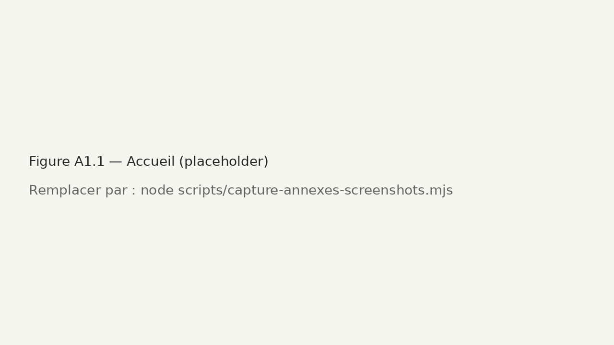

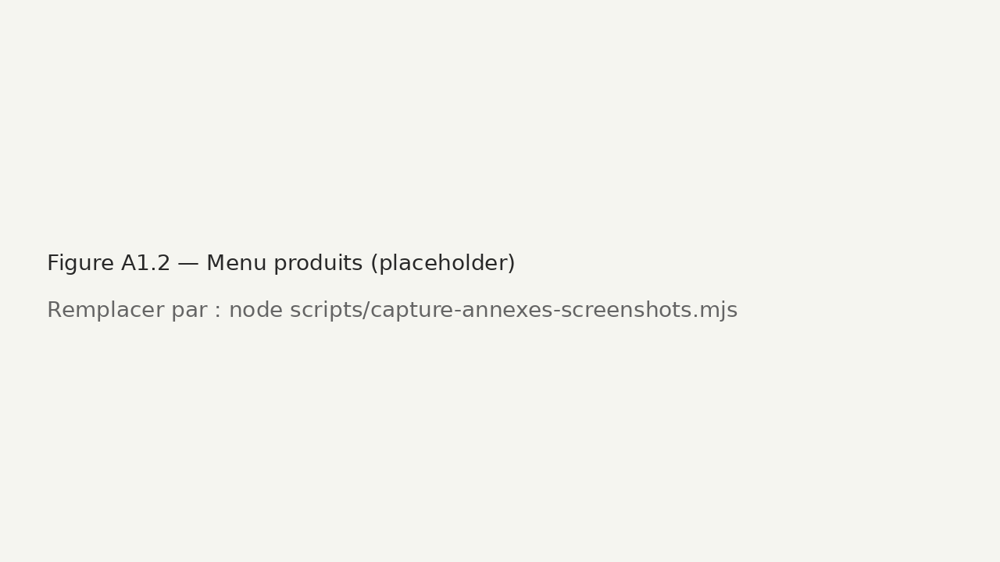

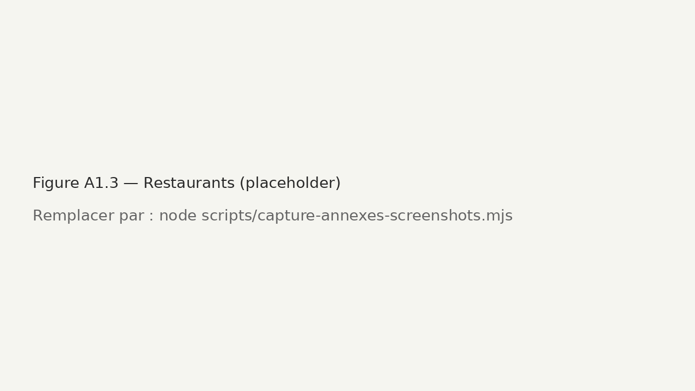

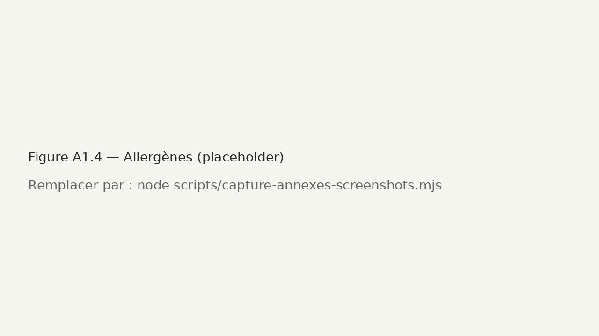

> Les fichiers `site-*.png` et `admin-*.png` sont des **placeholders** tant que Chrome n'est pas disponible sur le serveur. Les remplacer par de vraies captures : `node scripts/capture-annexes-screenshots.mjs`.

---

### Annexe 2 — Captures d'écran du back-office

| Figure | Écran | Fichier |
|--------|-------|---------|
| A2.1 | Connexion admin | `annexes/captures/admin-01-login.png` |
| A2.2 | Tableau de bord / catalogue | `annexes/captures/admin-02-tableau-de-bord.png` |

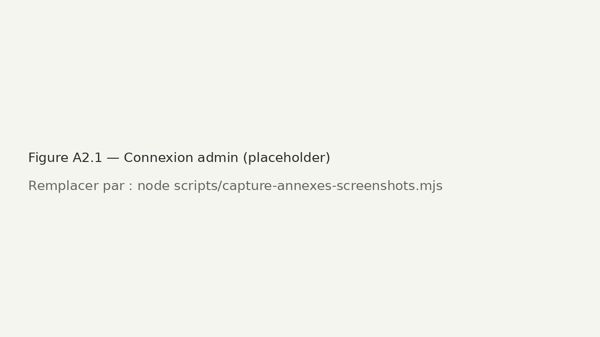


---

### Annexe 3 — Schéma 1 : Chaîne de synchronisation (Node.js → Supabase → API JDC)

Le module `jdc-sync.js` interroge l'URL Supabase (`JDC_PUBLIC_PRODUCTS_URL`). La fonction Edge sert de **relai** vers l'API catalogue JDC ; le serveur Node ne contacte jamais JDC directement.


---

### Annexe 4 — Schéma 2 : Modèle de données (synchronisation JDC)

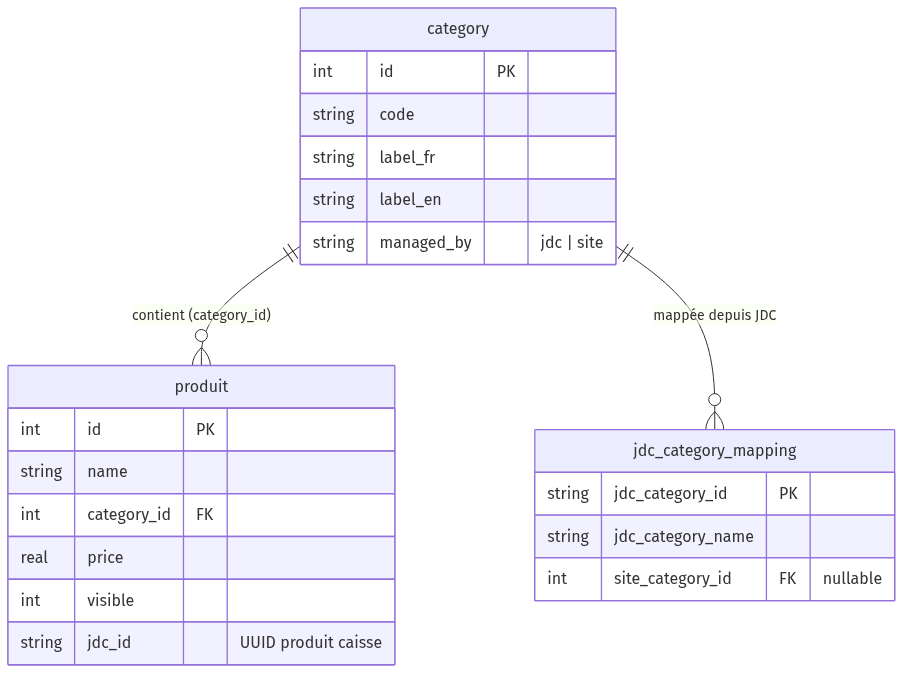

`category.managed_by` pilote la sync ; `produit.jdc_id` rapproche site ↔ caisse ; `jdc_category_mapping` relie catégories JDC (UUID) aux catégories site.

---

### Annexe 5 — Schéma 3 : Architecture technique globale du site

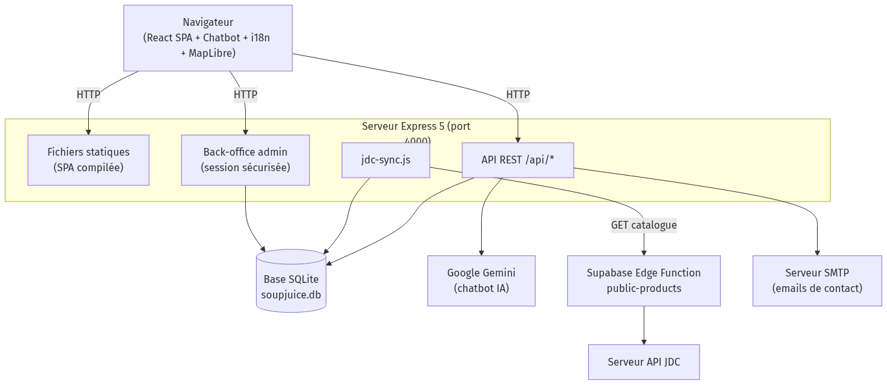

---

### Annexe 6 — Schéma 4 : Séquence du cycle de synchronisation JDC

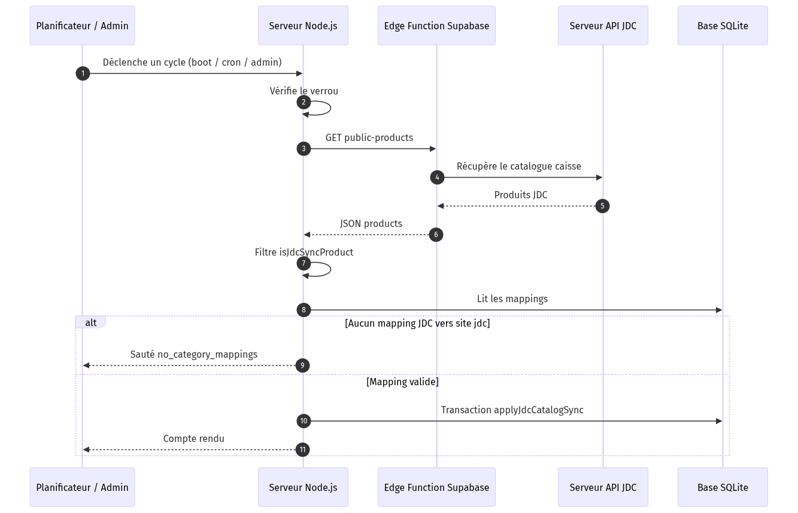

---

### Annexe 7 — Schéma 5 : Modèle de données complet du catalogue site

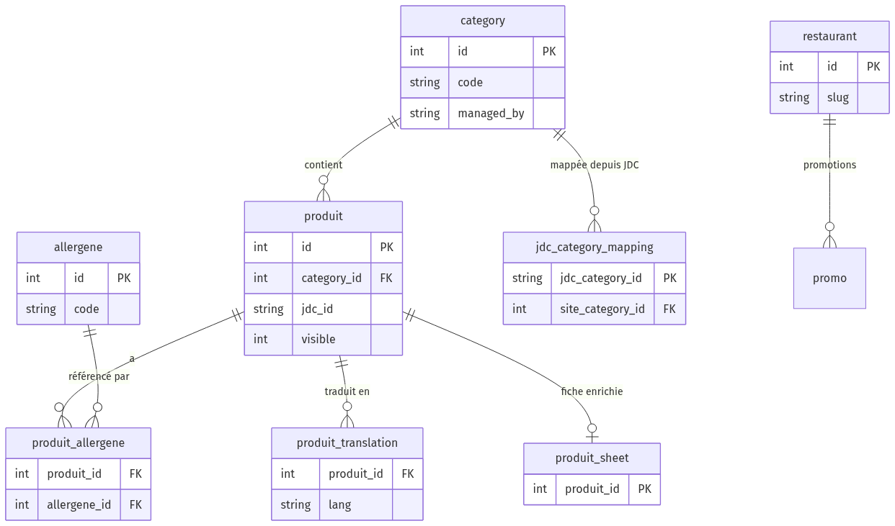

Entités : `category`, `produit`, `allergene`, `produit_allergene`, `produit_translation`, `produit_sheet`, `jdc_category_mapping`, `restaurant`.

---

### Annexe 8 — Schéma 6 : Flux de décision par produit JDC

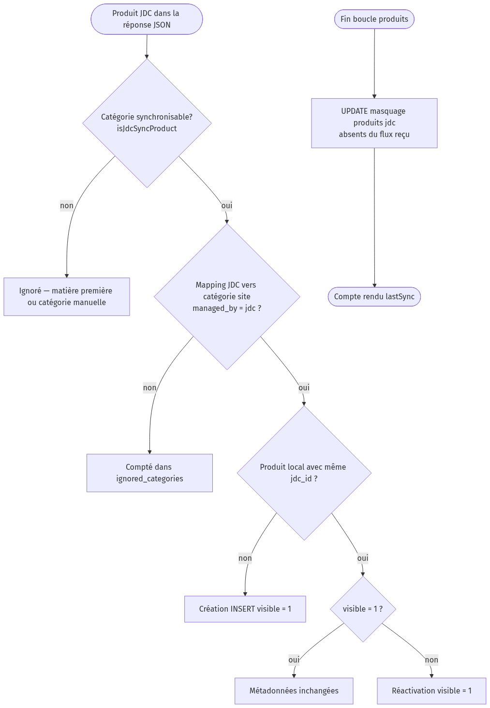

---

### Annexe 9 — Schéma 7 : Déploiement production

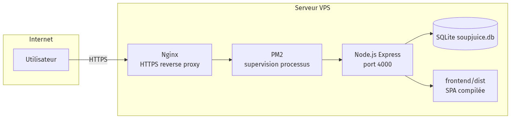

Internet → **Nginx** (HTTPS) → **PM2** → **Node.js Express** → **SQLite** + `frontend/dist`.

---

### Annexe 10 — Extraits de code représentatifs

Cette annexe regroupe les **fragments les plus significatifs** du module de synchronisation JDC. Chaque extrait est **réel** (projet `spsite`) ; les numéros de lignes renvoient aux fichiers sources au moment de la rédaction.

| Réf. | Fichier | Rôle dans la Partie 3 |
|------|---------|------------------------|
| A10.1 | `server/jdc-categories.js` | Filtrage métier des catégories JDC |
| A10.2 | `server/jdc-sync.js` | Récupération HTTP du catalogue (validation défensive) |
| A10.3 | `server/db.js` | Garde-fou `no_category_mappings` |
| A10.4 | `server/db.js` | Transaction SQLite atomique (`db.transaction`) |
| A10.5 | `server/db.js` | Boucle création / réactivation produit |
| A10.6 | `server/db.js` | Masquage (*soft delete*) des produits absents de JDC |
| A10.7 | `server/jdc-sync.js` | Orchestration : verrou, `try/catch/finally` |
| A10.8 | `server/db.js` | Catégories 100 % manuelles (`managed_by = 'site'`) |

---

#### A10.1 — Éligibilité d'un produit JDC

*Fichier : `server/jdc-categories.js` — fonction `isJdcSyncProduct`.*

```javascript
export function isJdcSyncProduct(product) {
  const name = String(product?.category_name || "").trim();
  if (!name) return false;
  if (JDC_SUPPLY_CATEGORIES.has(name)) return false;       // matières premières / entretien
  if (JDC_MANUAL_SITE_CATEGORIES.has(name)) return false;  // gérées manuellement côté site
  return true;
}
```

---

#### A10.2 — Récupération HTTP du catalogue (validation en trois niveaux)

*Fichier : `server/jdc-sync.js` — fonction `fetchJdcProducts` (l. 56–87).*

```javascript
async function fetchJdcProducts() {
  const { url, anonKey } = getConfig();
  const headers = { Accept: "application/json" };
  if (anonKey) {
    headers.apikey = anonKey;
    headers.Authorization = `Bearer ${anonKey}`;
  }

  const res = await fetch(url, { headers });
  if (!res.ok) {                                   // 1. code HTTP d'erreur
    const text = await res.text().catch(() => "");
    throw new Error(`HTTP ${res.status} ${res.statusText} — ${text.slice(0, 200)}`);
  }

  let payload;
  try { payload = await res.json(); }              // 2. réponse non-JSON
  catch (err) { throw new Error(`Réponse non-JSON : ${err.message}`); }

  const products = Array.isArray(payload?.products) ? payload.products
    : Array.isArray(payload) ? payload : null;     // 3. structure inattendue
  if (!products) throw new Error("Réponse JDC inattendue : champ `products` absent.");
  return products;
}
```

---

#### A10.3 — Garde-fou anti-vidage du catalogue

*Fichier : `server/db.js` — début de `applyJdcCatalogSync` (l. 1141–1167). Si aucune catégorie JDC n'est mappée vers une catégorie site en mode `'jdc'`, la synchronisation est **annulée** sans écrire en base.*

```javascript
const hasAtLeastOneMappedJdcCat = mappingRows.some(
  (m) => m.site_category_id != null && m.managed_by === "jdc"
);

if (!hasAtLeastOneMappedJdcCat) {
  return {
    skipped: "no_category_mappings",
    jdc_received: allProducts.length,
    created: [],
    /* … statistiques sans modification de visible … */
  };
}
```

---

#### A10.4 — Transaction SQLite atomique

*Fichier : `server/db.js` — `applyJdcCatalogSync` (l. 1169–1278). La bibliothèque **better-sqlite3** encapsule `BEGIN` / `COMMIT` / `ROLLBACK` via `db.transaction()` : en cas d'exception dans le callback, **aucune** écriture n'est conservée.*

```javascript
const txn = db.transaction(() => {
  const upsertCatMap = db.prepare(
    `INSERT INTO jdc_category_mapping (jdc_category_id, jdc_category_name, site_category_id, updated_at)
     VALUES (?, ?, NULL, datetime('now'))
     ON CONFLICT(jdc_category_id) DO UPDATE SET
       jdc_category_name = excluded.jdc_category_name,
       updated_at = excluded.updated_at`
  );
  // … enregistrement des catégories JDC, boucle produits, masquage …
  return { deactivated };
});

const { deactivated } = txn();
```

---

#### A10.5 — Boucle de décision : création et réactivation

*Fichier : `server/db.js` — corps de la transaction (l. 1222–1251). Les produits déjà visibles ne sont **pas** modifiés (métadonnées enrichies préservées).*

```javascript
for (const p of products) {
  const jdcId = String(p?.id || "").trim();
  if (!jdcId || !isJdcSyncProduct(p)) continue;

  const catInfo = catMapByJdc.get(p?.category_id || "");
  const isMapped =
    catInfo && catInfo.siteCatId != null && catInfo.managedBy === "jdc";
  if (!isMapped) {
    ignored_categories[p?.category_name || "—"] =
      (ignored_categories[p?.category_name || "—"] || 0) + 1;
    continue;
  }

  const existing = findByJdcId.get(jdcId);
  if (!existing) {
    insertProd.run(name, catInfo.siteCatId, price, jdcId);
  } else if (!existing.visible && existing.managed_by === "jdc") {
    reactivate.run(existing.id);
  }
}
```

---

#### A10.6 — Masquage des produits disparus (*soft delete*)

*Fichier : `server/db.js` — fin de la transaction (l. 1262–1272), exécuté dans la même transaction que A10.4–A10.5.*

```sql
UPDATE produit
SET visible = 0, updated_at = datetime('now')
WHERE visible = 1
  AND category_id IN (SELECT id FROM category WHERE managed_by = 'jdc')
  AND (
    jdc_id IS NULL
    OR TRIM(jdc_id) = ''
    OR jdc_id NOT IN (SELECT uuid FROM _jdc_uuid_tmp)
  );
```

---

#### A10.7 — Orchestration du cycle : verrou et tolérance aux pannes

*Fichier : `server/jdc-sync.js` — fonction `runJdcSync` (l. 91–153). Le drapeau `running` empêche deux sync concurrentes ; le `catch` trace l'erreur sans arrêter le serveur.*

```javascript
export async function runJdcSync({ source = "manual" } = {}) {
  if (running) {
    return { ok: false, error: "Sync déjà en cours.", lastSync };
  }
  running = true;

  try {
    const products = await fetchJdcProducts();
    const stats = applyJdcCatalogSync(products);   // transaction A10.4
    lastSync = { status: "ok", /* … statistiques … */ };
    return { ok: true, lastSync, skipped: stats.skipped || null };
  } catch (err) {
    lastSync = { status: "error", error: String(err?.message || err) };
    return { ok: false, error: lastSync.error, lastSync };
  } finally {
    running = false;
  }
}
```

---

#### A10.8 — Catégories éditoriales sanctuarisées

*Fichier : `server/db.js` — initialisation : ces catégories restent en `managed_by = 'site'` et ne sont **jamais** pilotées par JDC.*

```sql
UPDATE category SET managed_by = 'site'
WHERE code IN ('JUS', 'MILKSHAKES', 'BOOSTERS', 'GOODIES', 'BOISSONS');
```

---

### Annexe 11 — Configuration et endpoints API (synchronisation JDC)

#### Variables d'environnement

| Variable | Rôle | Défaut |
|----------|------|--------|
| `JDC_SYNC_ENABLED` | Active / désactive la sync | `1` |
| `JDC_PUBLIC_PRODUCTS_URL` | URL Edge Function | `…/functions/v1/public-products` |
| `JDC_ANON_KEY` | Clé Supabase (optionnelle) | vide |
| `JDC_SYNC_INTERVAL_MIN` | Intervalle cron (minutes) | `30` |

#### Endpoints admin

| Méthode | Route | Rôle |
|---------|-------|------|
| `GET` | `/api/admin/jdc-sync/status` | État `lastSync` + résumé catalogue |
| `POST` | `/api/admin/jdc-sync/run` | Cycle manuel |
| `GET` | `/api/admin/jdc-sync/catalog` | Catalogue JDC filtré |
| `GET` | `/api/admin/jdc-sync/category-mappings` | Mappings catégories |
| `PUT` | `/api/admin/categories/:id/managed-by` | Bascule `managed_by` |

#### Déclencheurs

| Source | Moment |
|--------|--------|
| `boot` | Démarrage serveur |
| `cron` | Toutes les `JDC_SYNC_INTERVAL_MIN` min |
| `admin` | Bouton back-office |

## Bibliographie

> Consigne : conseillée en annexe complémentaire.

**Documentations techniques officielles :**

- Documentation officielle Node.js — https://nodejs.org/docs/
- Documentation officielle React 19 — https://react.dev/
- Documentation officielle Vite — https://vite.dev/
- Documentation Express 5 — https://expressjs.com/
- Documentation `better-sqlite3` — https://github.com/WiseLibs/better-sqlite3
- Documentation MapLibre GL JS — https://maplibre.org/
- Documentation i18next / react-i18next — https://www.i18next.com/
- Documentation Google Gemini API — https://ai.google.dev/
- Documentation Helmet (sécurité Express) — https://helmetjs.github.io/
- Documentation Supabase Edge Functions — https://supabase.com/docs/guides/functions

**Références normatives et réglementaires :**

- CNIL — Recommandations RGPD et cookies — https://www.cnil.fr/
- Règlement (UE) n° 1169/2011 (information des consommateurs sur les denrées alimentaires — 14 allergènes).
- Référentiel WAI-ARIA (accessibilité web) — https://www.w3.org/WAI/standards-guidelines/aria/

**Enseignements du Cnam :**

- Cours du Cnam relatifs aux systèmes d'information, aux architectures réseaux et à la cybersécurité _(préciser les unités d'enseignement suivies : ex. UTC 504, NFE 114, SEC 105, GDN 100)_.
